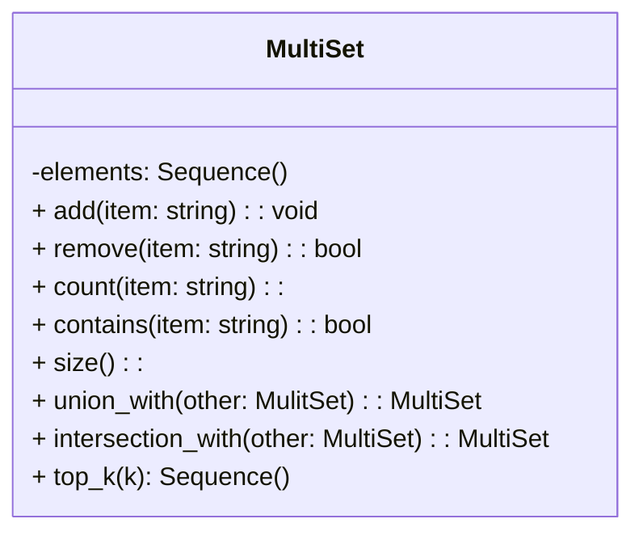

## Introduction

My design models a gaming system where elements can appear multiple times, these elements include inventory items, enemy loot drops, resource system, and monster spawn tables. Rather than going with a traditional Set that restricts elements to a single occurrence it's better to implement a MultiSet, which allows elements to appear multiple times. By storing strings that represent names of items and associating each with a count to represent exactly how many copies exist within a collection. For this design I'm building it atop a Sequence(<string>). 

## Design Philosophy

The design of this will prioritize efficiency, simplicity, extensibility, and readability.

**Efficiency** for this design is focusing on the practical suitability for realistic gameplay workloads. Choosing to build atop Sequence data structure it'll benefit predictable performances, memory simplicity, and low structural overhead. Actions such as searching for an item, counting how many times it appears, or removes requires scanning through a list. Keeping in mind that a majority of game inventories and resource pools are mainly small, at such a scale a linear scan typically completes very quickly. Building atop a Sequence(<string>) data structure it stores its elements contiguously in memory making it cache-friendly and predictable. 

**Simplicity** allows operations in the Sequence(<string>) data structure to behave in an easily understood manner. Making the operations built atop are straightforward and concise making it easy to add any future modifications. Since there is not another indexing system because each occurrence of an item is stored in the list and the internal state just mirrors what the MultiSet represents makes it simple to test and debug. Meaning if a problem were to happen I can examine the list directly, giving it a level of transparency.

**Extensibility** ensures that the Sequence(<string>) data structure can evolve/grow as game features or operations grow to become more complex over time. With building atop Sequence(<string>) data structure there are minimal constraints ensuring that there is room to easily add new behaviors, traversal patterns, etc. Items will have the ability to be dynamically inserted, rearranged, duplicated, or removed without breaking the structural constraints. 

**Readability** is essential in the design for the MultiSet because it'll make sure the public interface remains clear and understandable, along with the internal state. By building atop a Sequence(<string>) data structure avoids complex data structures and keeps it simple, like a bag of elements, for developers. This level of transparency helps testing and debugging become more readable. This will also help with the long-term stability.

The clients for the MultiSet class would be the inventory, crafting, loot system, monster spawning, and resource tracker. The inventory would keep track of what items are being collected by the player. While the crafting checks and uses the material items from the player. The loot system would randomly decide what items get dropped by defeated monsters, and what items if any are in chests. The monster spawning dictates which monster would spawn by weight, difficulty that is determined by weight, and what areas certain monsters have a better chance of spawning than others. Lastly the resource tracker would determine the quantities of items in the environment. All these systems would call operations like 
* insert(item)
* remove(item)
* count(item)
* contains(item)
* size()

Meanwhile the user side that has access to the MultiSet class is me, and any collaborating developers working on the systems to interact with the MultiSet.

## Core Operations

For this MultiSet it will be supporting some essential operations that store, modify, or retrieve items that occur multiple times. Each copy of an item is stored as its own element within the dynamic list in the Sequence(<string>) data structure. The five core operations are insert, remove, count, contains, and size.

### insert operation
The operation insert has the conceptual behavior of adding one occurrence of a given item in MultiSet. This will help when the player picks up a new item or when the player receives loot from a defeated enemy. The time complexity would be O(1), the item would be appended to the end of the item list. There are some edge cases such as large amounts of adds that may trigger the resizing. 

### remove operation
The operation remove has a conceptual behavior of deleting one occurrence of the given item in the MultiSet. This will help when the player uses an item such as using a potion or shooting an arrow, or when the player discards/drops and item. The time complexity would be O(n) due to the linear searching, however in the Sequence data structure it is scanned from the front of the list meaning the first matching item/element will be deleted. The edge cases are if the item doesn't particularly exist which could perform no action of break the system if not handled, and another edge case would be deleting from an empty MultiSet.

### count operation
The operation count has a conceptual behavior of returning the number of times an item appears in the MultiSet. The entire list will be scanned and the counter would increment for each time the same matching items shows up. The time complexity would be O(n) for all the items being checked through scanning. Some edge cases would be that some items may not appear resulting in a count of zero. 

### contains operation
The operation contains has a conceptual behavior of checking the MultiSet for at least one instance of the item. This is done during crafting potions, the player will need certain ingredients to craft a potion and the contains will check that the player has those ingredients. The Sequence data structure behavior is scan a list until a match is located. The time complexity would be O(1) if the ingredient items are found earlier in the list, and O(n) if the ingredient items are farther down the list. Some edge cases of concern would be an empty MultiSet will always return false, and case-sensitive comparisons.

### size operation
The operation size has a conceptual behavior of returning the total number of elements in the MultiSet, which include duplicates.The Sequence data structure does track its own size. The time complexity would be O(n) if Sequence doesn't maintain internal size O(1). An edge case would be if the MultiSet is empty.

## Set Operations
Two set-like operations that I would be implementing in the MultiSet are union_with() and intersection_with(). 

### union_with()
This set-like operation would combine the items of two inventories, this typically happens when a player opens a chest to find loot inside, loots off of a defeated monster, or trading with another player/npc. Union_with() would modify the MultiSet to include all the items from both inventories, for example if there are 5 arrows in one set and 4 arrows in another it will combine them to make a total of 9 arrows. However it'll have to iterate through every element of the other Sequence and append each matching element to the current internal MultiSet Sequence. The conceptual time complexity for union_with() will be O(m + n) but will be mostly dominated by O(n). Some edge cases would be if union_with() gets used on an empty MultiSet, which would just return the original set, or on extremely large inventories that could trigger internal resizing to happen. 

### intersection_with()
This set-like operation would be used to find items that appear in both MultiSets, this typically happens when multiple players are sharing the same crafting materials, or the loot items from a defeated monster need to be shown to multiple players. Intersection_with() would store each occurrence on an element as its own entry in the Sequence(<string>) by scanning the Sequence element by element to check if the MultiSet contains a matching occurrence, then checks the second list exactly the same way, and if a match is found it will append it to a new Sequence. The conceptual time complexity for intersection_with() would be O(m x n). Some edge cases would be is the items appear in one set but not the other, identifying case-sensitivity, or if either MultiSet is empty.

## Extension Feature
The extension feature I would us for the MultiSet is top_k(k) operation, which returns the k most frequent items. This will enhance the gameplay interface for the player because this operation could be used to display what materials the player tends to hoard the most. 

## UML Diagram

The core operations along with the extension feature for the MultiSet define behaviors that the external game systems relies on. If these operations were private then it could prevent the system from simply adding and could cause the MultiSet to error. 

## Trade-off Analysis
My chosen base data structure is Sequence(<string>), the alternative that I will be comparing this to is HashTable(<string, unsigned int>). 

HashTable offers faster performance for lookup operations especially with larger lists. However it requires complex implementation making it a little difficult to follow along and easily to make an error. In the table below shows the trade-offs between Sequence vs HashTable.

| Criterion | Sequence <string> | HashTable <string, unsigned int> |
| --- | ---| ---|
| Traversal Order | Preserved | Arbitrary |
| Space Overhead | low (stores raw duplicates) | high (bucket, hashing metadata) |
| Implementation Complexity | very low | medium-high |
| Best Use Case | small to medium collections | large collections |

I didn't choose HashTable because I wanted a level of transparency, and ease of implementation for a simple structural foundation.

## Alternative Design Sketch
Below is a side-by-side comparison how the design would differ. 

| Design Aspect | Sequence | HashTable |
| --- | --- | --- |
|Internal | Stores each occurrence as a separate string in a dynamic list | Stores one key per unique item within an integer count |
| Conceptual Model | Mirrors a bag of items | Requires mapping key to counts/pairs |
| Add Operation | appends new string | increments the count in HashTable |
| Remove Operation | linear search to find matching item and delete it | Decrement the count or simply erase the key |
| Count | Does require scanning | Constant time lookup |

If I changed the design over to HashTable the contains, count, and remove operations would have a faster performance. The downside would be more of an abstract internal structure making it a little less predictable than Sequence. 

## Evaluation Plan
My plan would include functional testing, edge-case testing, and performance. These testing method will provide evidence that the MultiSet behaves correctly, scales appropriately, or if further debugging is needed. 

### Functional Testing
With the core operations tests to ensure that items will be appended correctly, removed if used, the returned count matches the actual number of occurrences, testing cases in contains if the items exists, or do not exists, size comparison against the manual count. With set operations the validation that every item from both MultiSets appears in the result with union_with(). 

### Edge Case Testing
Testing for any unusual or boundary conditions which would include:
* Empty MultiSets for all operations
* Removing non-existent items
* Handling large inventories
* Case sensitivity behavior
* How repeated matching items in irregular order are handled

### Performance Testing
I would focus on timing test for core operations as the MultiSet grows, and to rapidly test insert, remove of items to ensure no break of performance.

## Conclusion
Designing the MultiSet atop of Sequence(<string>) data structure allows me to maintain clarity, and predictable behavior. Although there were other data structures that I had to consider, HashTable and AVLTree, which provided more efficient removals, lookups, and their complexities to handle large lists. I decided to stick with Sequence because it is beginner friendly making it easy to understand for software developers to detect any bugs, and to add more operations further down the road.

## Sources
B Lokeshwar, et al. "Analysis of Time and Space Complexity of Array, Linked List and Linked Array(hybrid) in Linear Search Operations". IEEE. 2022 International CConference on Data Science, Agents & Artificial Intelligence. 2022. pp 1 - 6. doi: 10.1109/ICDSAAI55433.2022.10028872. [link](https://ieeexplore-ieee-org.ezproxy.libraries.wright.edu/document/10028872)

